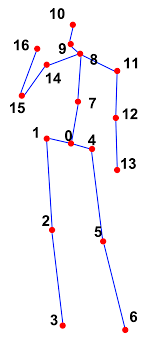

# Video-Pose-Estimation

This repository is taken as an inspiration from [here](https://github.com/hafizas101/Real-time-human-pose-estimation-and-classification) with the following modifications:
1. Used MMPose instead of OpenPose.
2. Used **Human** model of MMPose that gives 17 keypoints instead of **BODY_25** model of OpenPose.
3. Implemented modules and easy-to-understand code.


## Why MMPose?
1. **Flexibility and Customization:** MMPose is an open-source toolbox for pose estimation based on PyTorch. It supports both top-down and bottom-up approaches and provides a wide range of models and algorithms for pose, hand, and whole-body estimation. This flexibility allows developers to choose the most suitable approach for their specific use case.
2. **Advanced Features:** MMPose offers advanced features such as 2D keypoint and 3D surface estimation. It also supports different industries including sports analysis, robotics, healthcare, security and surveillance, and entertainment.
3. **Performance and Accuracy:** MMPose provides state-of-the-art accuracy and fast inference time, making it suitable for real-time pose estimation and multi-person scenarios. It outperforms some alternatives like OpenPose in terms of accuracy and computational efficiency.
4. **Cost:** While OpenPose requires a non-refundable $25,000 USD annual royalty for commercial use, MMPose is freely available for commercial use under the Apache 2.0 license.

## Keypoints Comparision **HUMAN** model vs **BODY_25** model.

<p float="left">
  
   
</p>


| Serial No | mmpose Keypoints   | Modified openpose Keypoints |
|-----------|--------------------|-----------------------------|
| 0         | Nose               | Nose                        |
| 1         | Left Eye           | Neck                        |
| 2         | Right Eye          | Right Shoulder               |
| 3         | Left Ear           | Right Elbow                  |
| 4         | Right Ear          | Right Wrist                  |
| 5         | Left Shoulder      | Left Shoulder                |
| 6         | Right Shoulder     | Left Elbow                   |
| 7         | Left Elbow         | Left Wrist                   |
| 8         | Right Elbow        | MidHip                       |
| 9         | Left Wrist         | Right Hip                    |
| 10        | Right Wrist        | Right Knee                   |
| 11        | Left Hip           | Right Ankle                  |
| 12        | Right Hip          | Left Hip                     |
| 13        | Left Knee          | Left Knee                    |
| 14        | Right Knee         | Left Ankle                   |
| 15        | Left Ankle         | Right Eye                    |
| 16        | Right Ankle        | Left Eye                     |
| 17        |                    | Right Ear                    |
| 18        |                    | Left Ear                     |
| 19        |                    | Left Big Toe                 |
| 20        |                    | Left Small Toe               |
| 21        |                    | Left Heel                    |
| 22        |                    | Right Big Toe                |
| 23        |                    | Right Small Toe              |
| 24        |                    | Right Heel                   |
|           |                    | Background                   |

## How to set up MMPOSE?
To install mmpose, you need to first set up and install [mmaction2](https://github.com/open-mmlab/mmaction2).
Use this [documentation](https://mmaction2.readthedocs.io/en/latest/get_started/installation.html) to install mmaction2.
You can also directly use the steps mentioned below:
1. conda create --name mmaction python=3.10 -y
2. conda activate mmaction
3. conda install pytorch==1.13.1 torchvision==0.14.1 torchaudio==0.13.1 pytorch-cuda=11.7 -c pytorch -c nvidia
4. Install the following in sequence:
  pip install -U openmim
  mim install mmengine
  mim install mmcv
  mim install mmdet
  mim install mmpose
5. pip install mmaction2

## Pose Classification
Just like the original repository, we are classifying four poses as follows:
1. Hello 
2. Stop gesture
3. Sitting pose
4. Standing pose
   
For the detailed methodology and rule-based approach description, read this [passage](https://github.com/hafizas101/Real-time-human-pose-estimation-and-classification#pose-classification).

## How to run?
Change the video_path in the code and run the following.
```bash
python pose.py
